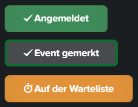

# Joyclub Custom Event Buttons – Stylus Style

A custom [Stylus](https://chrome.google.com/webstore/detail/stylus/clngdbkpkpeebahjckkjfobafhncgmne) style for [Joyclub Events](https://www.joyclub.de/dates_partys/events/registrations/) that changes the appearance of specific buttons on the site:

- **Angemeldet** → Dark green background
- **Auf der Warteliste** → Orange background
- **Event gemerkt** → Add a 4 px green border to the button  

## Preview

## Installation

1. Install the [Stylus browser extension from the Chrome Web Store](https://chrome.google.com/webstore/detail/stylus/clngdbkpkpeebahjckkjfobafhncgmne).  
2. Download [`joyclub-buttons.json`](joyclub-buttons.json) from this repository.  
3. In Stylus, click the **Manage** button (Stylus icon → "Manage").  
4. Click **Import** in the left-hand menu.  
5. Select the downloaded `joyclub-buttons.json` file.  
6. Enable the imported style.

## Compatibility

This style is designed **specifically for** [https://www.joyclub.de](https://www.joyclub.de) and will not affect other websites.
